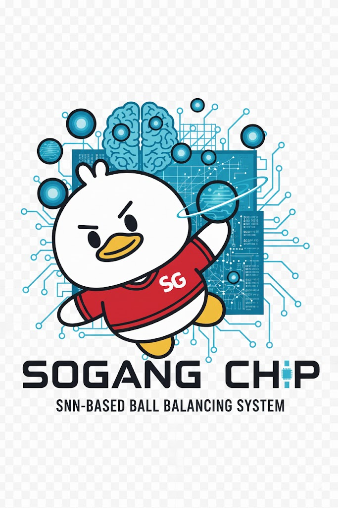

# Implementation-of-SNN-Based-PID-Controller-on-PYNQ-Z2

We are 'Sogang Chip'. We gathered for Sogang University's electronic engineering department design project, and we worked on digital circuit design in the second half of 25.

Our project activities are as follows.
 - Development of SNN-based PID Control Algorithm
 - PYNQ-Z2 Board Implementation and RTL Design
 - Implementing a Ball Balancing System Using Jupyter Notebook and Pybullet
 - AXI4-Lite Interface design
 - Event-Driven Ultra-Low Power, High-Speed Operations

We utilized a PID control method designed to vary neuronal firing rates based on the ball's position and weight. System stability was ensured by converting floating-point equations into fixed-point format and devising a robust ball position estimation algorithm.

Notably, we enhanced hardware efficiency by applying membrane potential values from control neurons trained via software Hybrid RL, replacing the complex division and multiplication operations typically required in PID calculations. By implementing a pipelined architecture, we achieved a deterministic latency of 4.97µs during FPGA operation at 100MHz, securing stable real-time control performance.

Our research extends beyond simple balance maintenance, suggesting a new control paradigm that mimics the motor control functions of the cerebellum.

-----------------------------------------------------------------------------------------------------------

We were undergraduate researchers at Sogang University's Digital Cirtuits and Systems Lab and presented at the Electronics and Engineering Conference in the second half of 2025. With the same theme, we won the third prize at the 2025 National University Student AI Semiconductor Circuit Design Competition Issued by Next-Generation Semiconductor Innovative Convergence University.

If you want to download this project,
copy and paste this script in your Vivado Tcl Console.

- cd [download path]
- source project_script.tcl

> # Click Here !!! 

P.S.
Thank you and praise all the team members Haneum-Kim, Hyosong-Shin, and Yena-Lee who have been with me over the past period.
Please share the open source code, but indicate the source so that our hard work is recorded.
