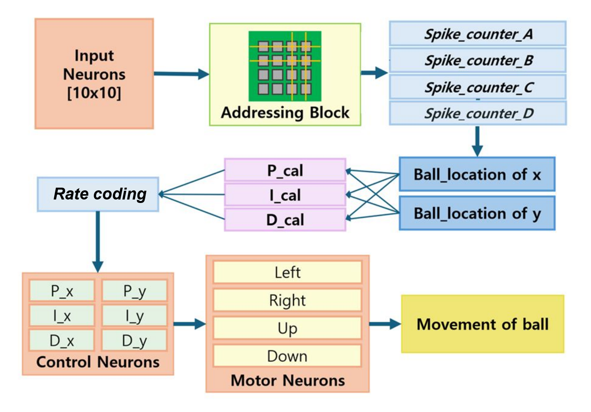

# Implementation-of-SNN-Based-PID-Controller-on-PYNQ-Z2

We are 'Sogang Chip'. We gathered for Sogang University's electronic engineering department design project, and we worked on digital circuit design in the second half of 25.

Our project activities are as follows.
 - Development of SNN-based PID Control Algorithm
 - PYNQ-Z2 Board Implementation and RTL Design
 - Implementing a Ball Balancing System Using Jupyter Notebook and Pybullet
 - AXI4-Lite Interface design
 - Event-Driven Ultra-Low Power, High-Speed Operations

We are undergraduate researchers at Sogang University's Digital Cirtuits and Systems Lab and presented at the Electronics and Engineering Conference in the second half of 2025. With the same theme, we won the third prize at the 2025 National University Student AI Semiconductor Circuit Design Competition hosted by IEIE.

Thank you and praise all the team members Haneum-Kim, Hyosong-Shin, and Yena-Lee who have been with me over the past period.
Please share the open source code, but indicate the source so that our hard work is recorded.

If you want to download this project,
copy and paste this script in your Vivado Tcl Console.

- cd [download path]
- source project_script.tcl

